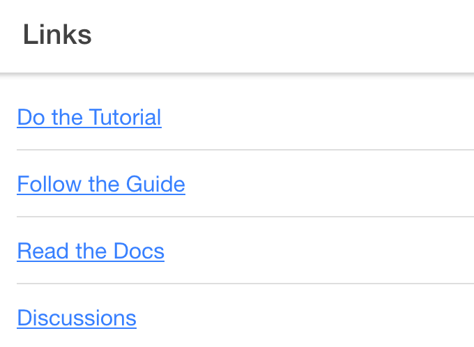

# Meteor + Ionic blank project

Based on the great [WhatsApp Clone with Meteor and Ionic 2 CLI](https://angular-meteor.com/tutorials/whatsapp2/ionic/setup)
tutorial, I wanted to start a _fresh_ Meteor + Ionic project with the current versions of these great frameworks.

Versions were:
- Meteor 1.9.2
- Ionic 5.4.13 (@angular/cli: 8.3.25)
- Running on Node 10.16.0

This was not straight forward...

After reading multiple resources on Git and Slackoverflow, I managed to have a working project based on the following steps.

Hopefully these steps could help lonely souls like me!

The result project (which simply display a list of links stored in Mongo) is also hosted here. 

## Bootstrap it
> Note: unless specified, all commands must be ran **in root directory**

- create ionic project
  - choose `Angular` framework and `blank` template
```shell script
ionic start
```
- move to the new project, for example if your project name was `test-meteor-ionic`
```shell script
cd test-meteor-ionic
```
- install Meteor
```shell script
curl https://install.meteor.com/ | sh
```
- create blank Meteor project
```shell script
meteor create --typescript api
```
- delete node modules and use the ones from top level
```shell script
cd api
rm -rf node_modules && ln -s ../node_modules .
rm -rf package.json && ln -s ../package.json .
rm -rf package-lock.json && ln -s ../package-lock.json .
```
- install some dependencies
```shell script
cd api
meteor npm install --save @babel/runtime
npm install --save meteor-node-stubs
npm install --save meteor-rxjs
npm install --save meteor-typings
meteor remove static-html
```
- add to `tsconfig.json`:
```json
  "exclude": [
    "api/node_modules",
    "api"
  ]
```
- add to `tsconfig.app.json` to the `exclude` section:
```json
    "api/node_modules"
```
- add to `tsconfig.json` and `tsconfig.app.json` to the `compilerOptions` section:
```json
  "types": [
      "meteor-typings"
    ],
```
- Install client bundler
```shell script
sudo npm install -g meteor-client-bundler
```
- add target to `package.json`:
```json
"meteor-client:bundle": "meteor-client bundle -s api"
```
- bundle client
```shell script
npm run meteor-client:bundle
```
- modify `browserslist` file, make it just this line:
```
> 5%
```

## Adapt it
- change api collections from Mongo collections to observable collections.
- in `api/imports/api/links.ts`
```typescript
export const Links = new MongoObservable.Collection<Link>('links');
```
- in `api/server/main.ts`
```typescript
Links.collection.insert({ title, url, createdAt: new Date() });
...
if (Links.collection.find().count() === 0) {
```
- add to `src/app/main.ts`:
```typescript
import 'meteor-client';
```

- update `src/app/home/home.page.ts`:
```typescript
  links: Observable<Link[]>;

  ngOnInit(): void {
    this.links = Links.find({});
  }
```

- update `src/app/home/home.page.html`:
```angular2html
<ion-list>
    <ion-item *ngFor="let link of links | async">
      <a href="{{link.url}}">{{link.title}}</a>
    </ion-item>
  </ion-list>
```

## Run it

- in api:
```shell script
meteor run
```
- in root dir:
```shell script
ionic serve
```

... and you should see the home page displaying links! 👌


